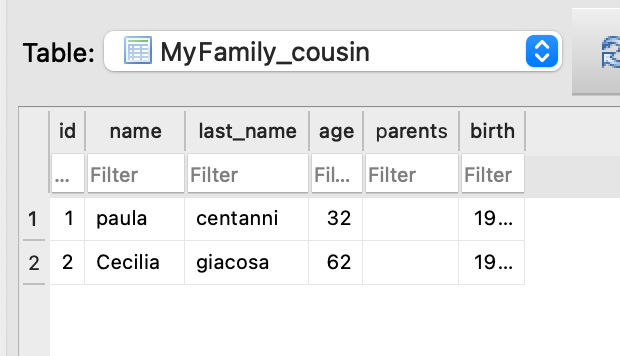

# Instrucciones

## Requisitos

- python3
- django
- git

## Configuración 

```console
git clone https://github.com/jaliagag/django_portfolio.git
cd django_portfolio
git pull origin entregable-clase18
cd entregable-clase18/MVTJoseAliaga
python manage.py runserver
```

## Uso/URLs

Usar **localhost:8000/** más uno de estos endpoints:

- health/ --> comprobar que el server está corriendo adecuadamente. Deberíamos ver `Status 200 - OK`
- view_family/ --> nos muestra el template
- holis/<name>/ --> nos saluda
- add_cousin/<vname>/<vlast_name>/<vage>/<vparents>/<vbirth>/ --> agregar un primo a la base de datos
- add_family_member/<vname>/<vlast_name>/<vage>/<vbirth>/ --> agregar un miembro de familia directa a la base de datos
- add_uncle/<vname>/<vlast_name>/<vage>/<vbirth>/ --> agregar un tío a la base de datos

## Ejemplos de la db




- agregamos un miembro de ejemplo


