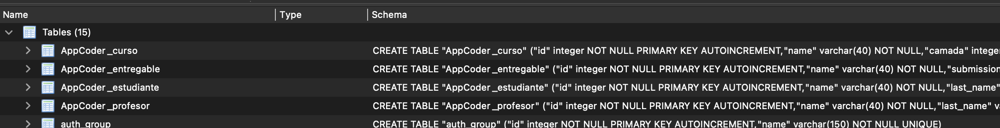
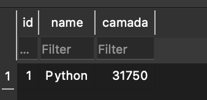
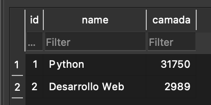

# Ejercicio entregable 6

Crear una web que permite ver los datos de algunos de tus familiares, guardados en una DB

1. deberá tener un template, una vista y un modelo (como mínimo, pueden usar más)
2. la clase del modelo deberá guardar mínimo un número, una cadena y una fecha (pueden ser más cosas)
3. se deberán crear como mínimo 3 familiares
4. los familiares se deben ver desde la web

## Pasos

1. crear carpeta
2. `django-admin startproject <nombredelproyecto>` - en este caso mvt6
3. `cd mvt6`
4. `python manage.py migrate`
5. `python manage.py runserver`
6. creamos el archivo `views.py` 
7. TASK: crear una vista. a `views.py` agregamos:

```py
from django.http import HttpResponse

def saludo(request):
  return HttpResponse('Hola django-coder')
```

8. en `mvt6/urls.py` agregamos:

```py
from mvt6.views import saludo
...
    path('saludo/', saludo),
...
```

9. TASK: pasar parámetros de python a HTML. 

```py
from datetime import datetime

def today(sequest):
    day = datetime.now()

    document = f'hoy es: {day}'

    return HttpResponse(document)
# agregar en mvt6/urls.py la ruta y la llamada a la función
```

10. TASK: parametros desde la url:

```py
# mvt6/views.py
def my_name(self, name):
    document = f'mi nombre es {name}'

    return HttpResponse(document)

# mvt6/urls.py
...
    path('minombre/<name>/',my_name)
...
```

11. TASK: crear un template:

- crear carpeta **templates**
- crear un archivo html dentro de **templates**
- llamamos a nuestro archivo html desde una nueva vista (en mvt6/views.py)

```py
# mvt6/views.py
from django.template import Template, Context

def template_test(self):
    myfile = open('<pathtofile>/templates/template1.html')

    my_template = Template(myfile.read())

    myfile.close()

    my_context = Context()

    document = my_template.render(my_context)

    return HttpResponse(document)
# mvt6/urls.py
  ...
  path('miprimeraplanilla/', template_test),
  ...
```

12. TASK: variables en planillas

```py
# mvt6/views.py
def vars_template(self):
    name = 'jose'
    last_name = 'aliaga'

    dictionary = {'nombre':name,'apellido':last_name}

    myfile = open('/Users/josemanuelfranciscoaliaga/22/django_portfolio/entregable-clase18/mvt6/mvt6/templates/template1.html')

    my_template = Template(myfile.read())

    myfile.close()

    my_context = Context(dictionary)

    document = my_template.render(my_context)

    return HttpResponse(document)
# mvt6/urls.py
  ...
  path('miaplanillavariable/', vars_template),
  ...
```

```html
# templates/template1.html
  <p style='color: red'>Mi nombre es: {{nombre}}</p>
  <p style='color: green'>Mi apellido es: {{apellido}}</p>
```

13. TASK: variables complejas en plantillas

para variables usamos `{{}}` y para bucles o condicionales usamos ``

```py
#mvt6/views.py
# agregamos una variable compleja

  my_list = [2,3,4,5,6,1]

  dictionary = {'nombre':name,'apellido':last_name,'lista':my_list}
```

Mostramos los valores de la lista:

```html
# templates/template1.html
  <p>Notas del curso:</p>

  <p>
  
  <p>{{i}}</p>
  
  </p>
```

Ejecutamos lógica en html:

```html
  <p>
  
    
      <p style='color:red'>Desaprobado: {{i}}</p>
     <p style='color:blue'>Aprobado: {{i}}</p>
    
  
  </p>
```

[referencia](https://docs.djangoproject.com/en/3.2/ref/templates/builtins/)

14. Loader (cargador) de plantillas: guardamos todas las plantaillas en una misma carpeta - lo especificamos en `settings.py`:

```py
# mvt6/settings.py
TEMPLATES = [
    {
        'BACKEND': 'django.template.backends.django.DjangoTemplates',
        'DIRS': ['/Users/josemanuelfranciscoaliaga/22/django_portfolio/entregable-clase18/mvt6/mvt6/templates/'],
        'APP_DIRS': True,
        'OPTIONS': {
...

# mvt6/views.py
from django.template import loader 

def using_loader(self):
    name = 'jose'
    last_name = 'aliaga'
    dt = datetime.now()

    my_list = [2,3,4,5,6,1]

    dictionary = {'nombre':name,'apellido':last_name,'hoy':dt,'lista':my_list}

    my_template = loader.get_template('template1.html')

    document = my_template.render(dictionary) # ya no necesitamos un contexto

    return HttpResponse(document)
```

**vemos el mismo resultado pero con menos código!**

15. Django hace una distinción entre proyecto y aplicación. Un proyecto es _todo_. Dentro del proyecto habrá varias aplicaciones, donde cada aplicación tendrá su función. Dentro de nuestro proyecto, usamos el comando `python manage.py startapp AppCoder` para crear una app llamada **AppCoder**

- Manejamos las urls de las apps en un archivo `urls.py` en cada app - en el `urls.py` del proyecto, simplemente hacemos referencia:

```py
# mvt6/AppCoder/urls.py
from django.urls import path
from AppCoder import views

urlpatterns = [
  path('',views.inicio), # método inicio - primera view, el home
  path('cursos/', views. cursos),
  ...  
]
# mvt6/urls.py
from django.contrib import admin
from django.urls import path, include

urlpatterns = [
  path('admin/',admin.site.urls),
  path('AppCoder/',include('AppCoder.urls')),
]
```

16. Modelo. ya tenemos templates (lo que se ve), view (información que se le pasa al template). Dentro de nuestra app, vamos al archivo `models.py` y usaremos clases para crear la estructura de nuestro modelo

```py
# mvt6/AppCoder/models.py
from django.db import models

class Curso(models.Model):
    name = models.CharField(max_length=40)
    camada = models.IntegerField()

class Estudiante(models.Model):
    name = models.CharField(max_length=40)
    last_name = models.CharField(max_length=40)
    email = models.EmailField()

class Profesor(models.Model):
    name = models.CharField(max_length=40)
    last_name = models.CharField(max_length=40)
    email = models.EmailField()
    profession = models.CharField(max_length=40)

class Entregable(models.Model):
    name = models.CharField(max_length=40)
    submission_date = models.DateField()
    submitted = models.BooleanField()
```

Ahora debemos informar a django de la app:

```py
#mvt6/settings.py

INSTALLED_APPS = [
    'django.contrib.admin',
    'django.contrib.auth',
    'django.contrib.contenttypes',
    'django.contrib.sessions',
    'django.contrib.messages',
    'django.contrib.staticfiles',
    'AppCoder', ## <<<<---
]
```

Para ver si vamos bien, corremos `python manage.py check AppCoder`

```console
$ p manage.py check AppCoder
System check identified no issues (0 silenced).
```

17. Transformaremos nuestros modelos en base de datos con `python manage.py makemigrations`

```console
$ p manage.py makemigrations
Migrations for 'AppCoder':
  AppCoder/migrations/0001_initial.py
    - Create model Curso
    - Create model Entregable
    - Create model Estudiante
    - Create model Profesor
```

Y veremos que se creó/modificó el archivo **db.sqlite3**. Ahora tenemos una DB _vacía_ - para generar la estructura corremos `python manage.py sqlmigrate AppCoder 0001`, que nos mostrará líneas de código SQL - para que impacten estas líneas de código debemos ejecutar `python manage.py migrate`

```console
$ p manage.py sqlmigrate AppCoder 0001
BEGIN;
--
-- Create model Curso
--
CREATE TABLE "AppCoder_curso" ("id" integer NOT NULL PRIMARY KEY AUTOINCREMENT, "name" varchar(40) NOT NULL, "camada" integer NOT NULL);
--
-- Create model Entregable
--
CREATE TABLE "AppCoder_entregable" ("id" integer NOT NULL PRIMARY KEY AUTOINCREMENT, "name" varchar(40) NOT NULL, "submission_date" date NOT NULL, "submitted" bool NOT NULL);
--
-- Create model Estudiante
--
CREATE TABLE "AppCoder_estudiante" ("id" integer NOT NULL PRIMARY KEY AUTOINCREMENT, "name" varchar(40) NOT NULL, "last_name" varchar(40) NOT NULL, "email" varchar(254) NOT NULL);
--
-- Create model Profesor
--
CREATE TABLE "AppCoder_profesor" ("id" integer NOT NULL PRIMARY KEY AUTOINCREMENT, "name" varchar(40) NOT NULL, "last_name" varchar(40) NOT NULL, "email" varchar(254) NOT NULL, "profession" varchar(40) NOT NULL);
COMMIT;

$ p manage.py migrate
Operations to perform:
  Apply all migrations: AppCoder, admin, auth, contenttypes, sessions
Running migrations:
  Applying AppCoder.0001_initial... OK
```



18. Agregar manualmente registro a la db:

- `python manage.py shell`
- importamos el modelo `from AppCoder.models import Curso`
- agregamos la información del curso `curso = Curso(name='Python',camada='31750')`
- cargamos el curso de la DB con `curso.save()`



19. Agregar datos a nuestra db desde nuestra vista:

```py
# mvt6/AppCoder/views.py
from django.shortcuts import render
from django.http import HttpResponse
from AppCoder.models import *

def create_course(self):
    course = Curso(name='Desarrollo Web', camada='2989')
    course.save()
    document = f'- Curso: {course.name} - camada = {course.camada}'

    return HttpResponse(document)
# mvt6/urls.py
from AppCoder.views import *
...
path('showmedb/',create_course),
...
```




